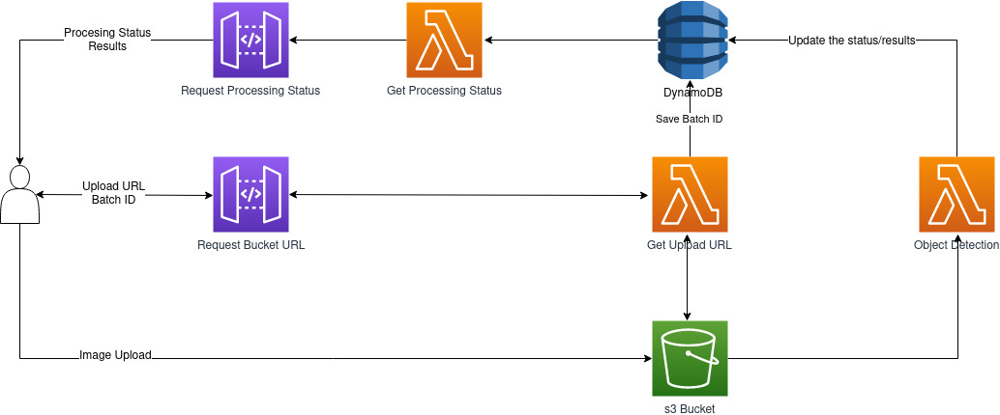

# Full Stack Exam Apis

Para auxiliá-lo no desenvolvimento da aplicação de detecção de objetos, desenvolvemos duas APIs: [Request bucket URL](./get_upload_url_api) e [Request Processing Status](./get_processing_status_api).

Dado um arquivo compactado (.zip) contendo as imagens (.jpg ou .png), pensamos na seguinte pipeline de uso:

 

 

1. Fazemos o request para a API Request bucket URL. Isso trigga uma função AWS Lambda (Get Upload URL) que:
    - Gera um batch id;
    - Cria um item para o batch id no banco de dados (AWS DynamoDB);
    - Faz um request ao AWS S3 Bucket para obter uma URL para upload;
    - Retorna o batch id e a URL para upload.
2. Utilizamos a URL para fazer o upload do arquivo compactado para o s3. Ao receber o arquivo, o s3 trigga outra função AWS Lambda (Object Detection) que:
    - Baixa o arquivo compactado do s3;
    - Faz a inferência de um algoritmo de detecção de objetos;
    - Atualiza o status do batch id no banco de dados.
3. Dado o batch id obtido em 1., utilizamos a API Request Processing Status. Isso trigga uma função AWS Lambda (Get Processing Status) que:
    - Faz o request do batch id no banco de dados para obter o status de processamento e os resultados da detecção de objetos para o batch.

---------------------------------------------------------------------------------
## Dúvidas
Entre em contato com bruno.yudy@daedalus-tech.com